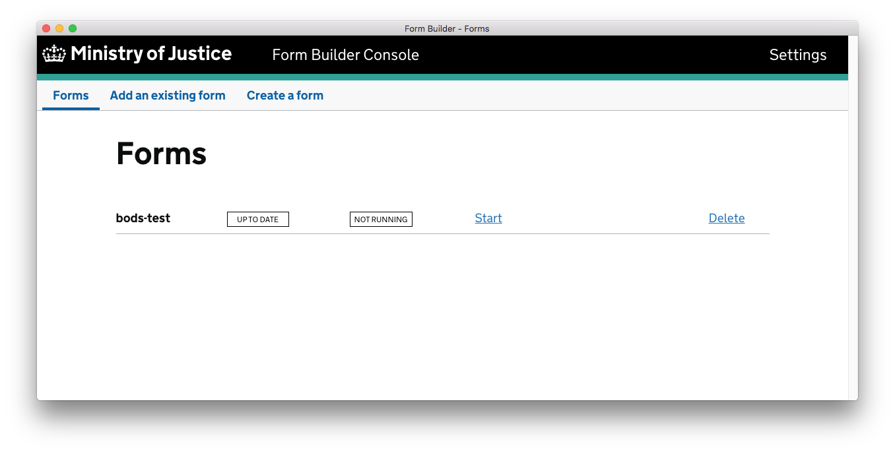
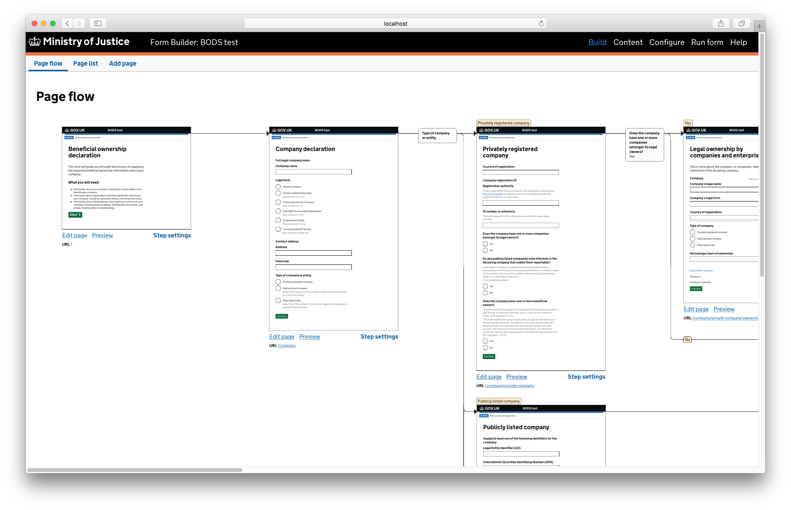
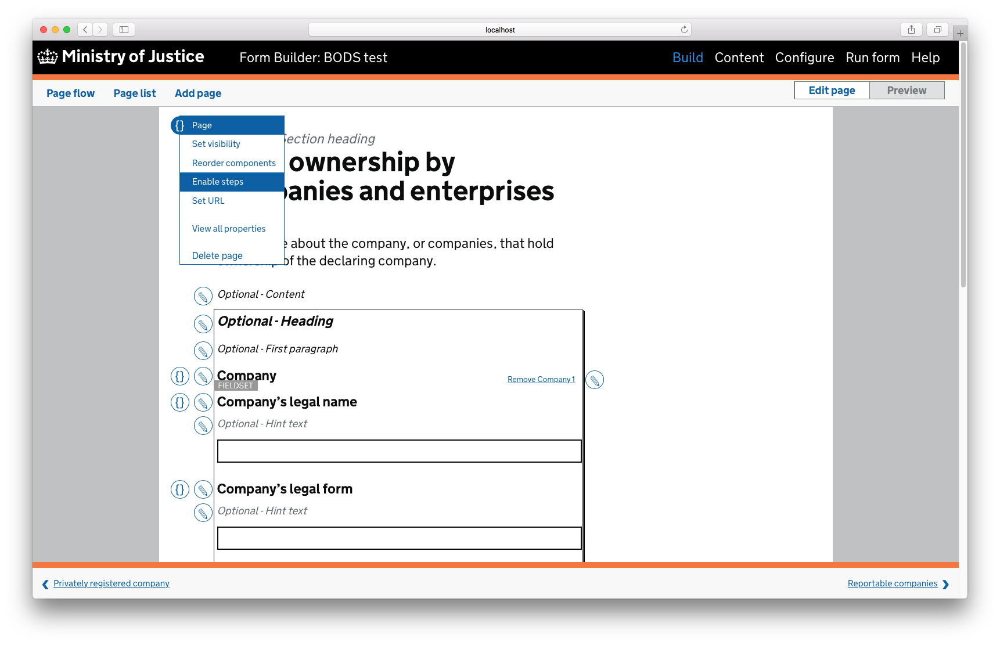
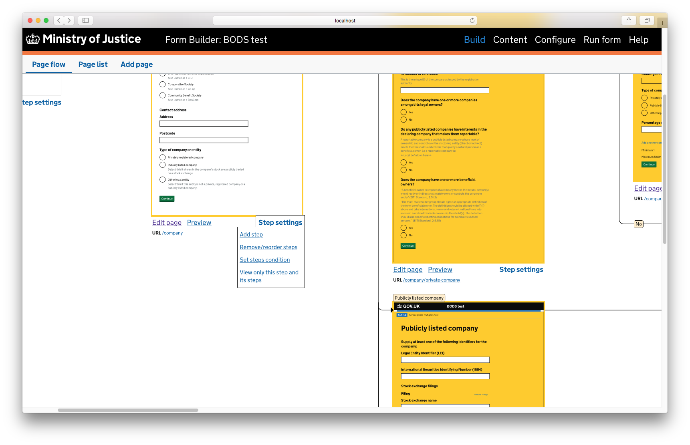
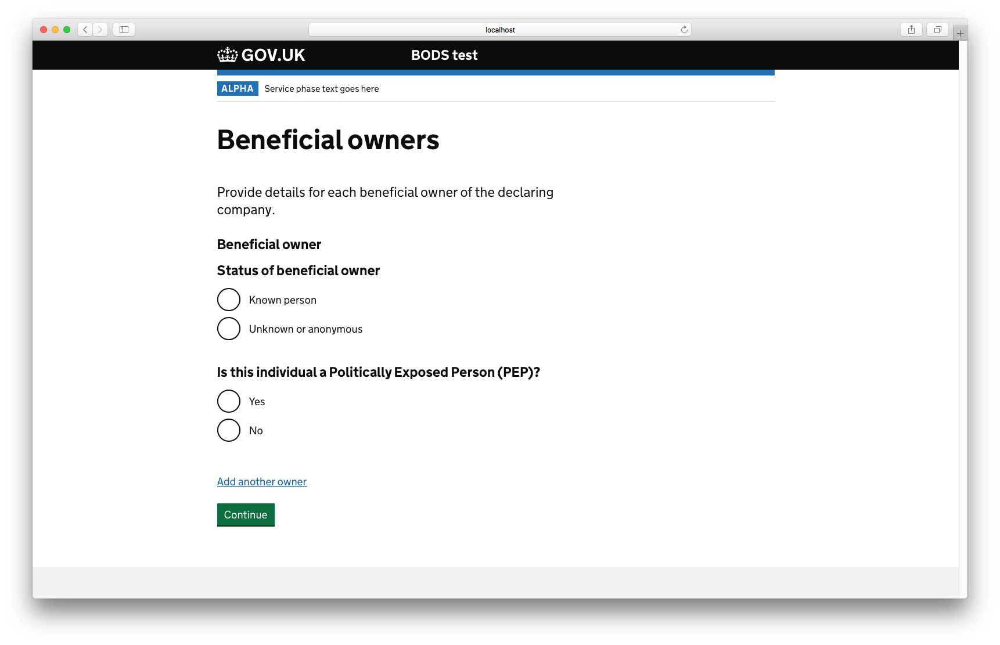

# Prototype of a form for collecting BODS-compliant data, using the MoJ Form Builder tool

This form was an early prototype of collecting [BODS](http://standard.openownership.org/en/0.2.0/)-compliant data at the point that a supplier might be registering with a local or national government procurement platform.

We used the [Ministry of Justice’s form builder tool](https://github.com/ministryofjustice/fb-editor-console-electron) to help us quickly put together a fully-functional prototype.

This Git repository contains all of the configuration for the prototype form.

## How to get this running locally

1. Install the MoJ [Form Builder Editor Console](https://github.com/ministryofjustice/fb-editor-console-electron). Currently this appears to be Mac-only.
2. Open the Form Builder Editor Console app, and select “Add an existing form” from the navigation bar.
3. Paste this repository’s URL into the text input:

       https://github.com/mysociety/bods-test

4. Press "Add the form", and the Editor Console will create a local clone of the form into `~/Documents/formbuilder/forms`.
5. You can now launch the Editor UI for the form by pressing the “Start” link next to the form’s name.

If you don’t want to use the Editor Console, or you’re using a platform that isn’t supported by the Editor Console app, then you _might_ be able to get the form running by installing and configuring the underlying [fb-editor-node](https://github.com/ministryofjustice/fb-editor-node) and [fb-runner-node](https://github.com/ministryofjustice/fb-runner-node) libraries on their own.

## How to use the editor

Press the “Start” link next to the bods-test form, and the form-builder editor interface will open in your browser.

At a fundamental level, the form is separated into ‘Pages’ that follow on from one another.

But if you “Enable steps” on a page, then you’ll be able to add new pages _as follow-on steps_ from that parent page, and you’ll be able to show those sub-steps conditionally, based on answers given earlier in the form.

You can add or edit the steps that follow on from a particular page, using the “Step settings” dropdown menu.

You can use the “Run form” link in the top right corner, to try the form out.

## How to commit and push changes to the form

Although the Form Builder Editor Console uses Git to import pre-existing forms, it doesn’t automatically commit changes to the form as you edit it.

If you want to commit your changes (perhaps to share them with your colleagues), you can commit from inside the Git repository, as you would any other repository. Eg:

    cd ~/Documents/formbuilder/forms/bods-test
    git add .
    git commit

At this point, since the Editor Console first cloned the repository with a `https` URL, you’ll probably want to add your own SSH upstream URL, so you can push without fiddling with HTTP authentication:

    git remote add upstream git@github.com:mysociety/bods-test.git
    git push upstream HEAD
